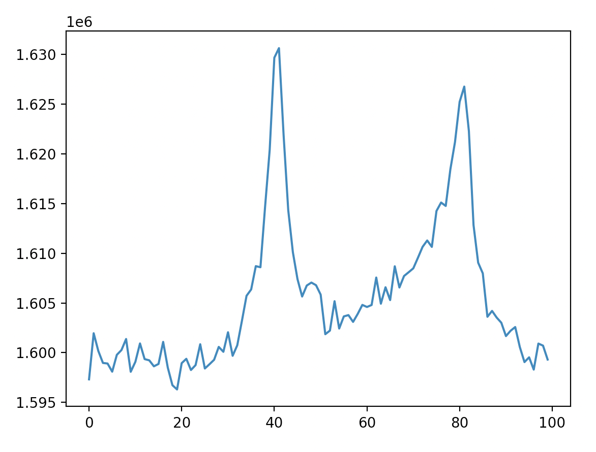

# gbm-pulsar
A tool to filter the Fermi/GBM data for pulsar analysis.

## Independencies
   - gbm-data-tool: The official GBMtools required to calculate the direction of each detector
   - jplephem: JPL solar ephemeris package required to execute the barycentric correction
   
## Install the packge
Download the whole gbm-pulsar package and unzip the compressed file. At the directory that contains the `setup.py` file and execute:

`pip install -e .`

## Processes

The detailed processes of the pipeline are:
   1. select all data for each detector (NaI and BGO) within an angle of 70 degrees to the given target source.
   2. exclude all data that obscure by Earth
   3. carry out the Barrycentric correction for each photon
   


## Example

```
gbm-pulsar-pipeline --gbm_dir="/path/to/GRM/data" \
        --tstart='2022-07-27T00:00:00' --tstop='2022-07-28T00:00:00' \
        --output_dir="/path/to/save/data" \
        --stem="gbmCrab" --ra=83.63321666666667 --dec=22.01446388888889 \
        --barycor --accelerate
```
After install the package, the executable command `gbm-pulsar-pipeline` are implemented in you python environment. The above command filters the data between `2022-07-27T00:00:00` and `2022-07-28T00:00:00`. 

`--barycor` flag is used, then the output FITS file contains the column `TDB` which is the time in barycentric center.

`--accelerate` flag is often used to accelate the proccess of barycentric correction. The algorithm is:
   - divide the data into 60 segments
   - calculate barycentric-corrected time for those 60 time at the edge of each segment
   - interpolate the barycentric-corrected time for each photon according to those 60 values

some optional:

```
gbm-pulsar-pipeline --gbm_dir="/path/to/GRM/data" \
        --tstart='2022-07-27T00:00:00' --tstop='2022-07-28T00:00:00' \
        --output_dir="/path/to/save/data" \
        --stem="gbmCrab" --ra=83.63321666666667 --dec=22.01446388888889 \
        --barycor --jplephem="./barycor/de421.bsp" \
        --energylow=8 --energyhigh=25 \
        --store_pha --store_det
```
Note: The localization the Crab pulsar are used from radio RA and Dec.
Here's one day profile folded by Jodrell Bank emphemeris, barycorr and selection works fine:



Example of runtime display:
```
...Analyzing data in 2022-01-29...
100%|█████████████████████████████████████████| 143/143 [00:07<00:00, 19.98it/s]
100%|█████████████████████████████████████████| 143/143 [00:04<00:00, 29.15it/s]
100%|█████████████████████████████████████████| 143/143 [00:06<00:00, 22.29it/s]
100%|█████████████████████████████████████████| 143/143 [00:06<00:00, 21.61it/s]
100%|█████████████████████████████████████████| 143/143 [00:05<00:00, 26.31it/s]
100%|█████████████████████████████████████████| 143/143 [00:06<00:00, 22.77it/s]
100%|█████████████████████████████████████████| 143/143 [00:06<00:00, 21.74it/s]
100%|█████████████████████████████████████████| 143/143 [00:05<00:00, 27.58it/s]
100%|█████████████████████████████████████████| 143/143 [00:04<00:00, 34.99it/s]
100%|█████████████████████████████████████████| 143/143 [00:05<00:00, 25.02it/s]
100%|█████████████████████████████████████████| 143/143 [00:03<00:00, 39.46it/s]
100%|█████████████████████████████████████████| 143/143 [00:03<00:00, 39.39it/s]
100%|█████████████████████████████████████████| 143/143 [00:12<00:00, 11.82it/s]
100%|█████████████████████████████████████████| 143/143 [00:04<00:00, 35.55it/s]
100%|█████████████████████████████████████████| 143/143 [00:04<00:00, 33.84it/s]
100%|█████████████████████████████████████████| 143/143 [00:05<00:00, 25.66it/s]
100%|█████████████████████████████████████████| 143/143 [00:08<00:00, 17.61it/s]
100%|█████████████████████████████████████████| 143/143 [00:05<00:00, 25.57it/s]
100%|█████████████████████████████████████████| 143/143 [00:04<00:00, 35.17it/s]
100%|█████████████████████████████████████████| 143/143 [00:06<00:00, 23.42it/s]
100%|█████████████████████████████████████████| 143/143 [00:04<00:00, 31.64it/s]
100%|█████████████████████████████████████████| 143/143 [00:05<00:00, 25.06it/s]
100%|█████████████████████████████████████████| 143/143 [00:13<00:00, 10.57it/s]
100%|█████████████████████████████████████████| 143/143 [00:12<00:00, 11.43it/s]
```
