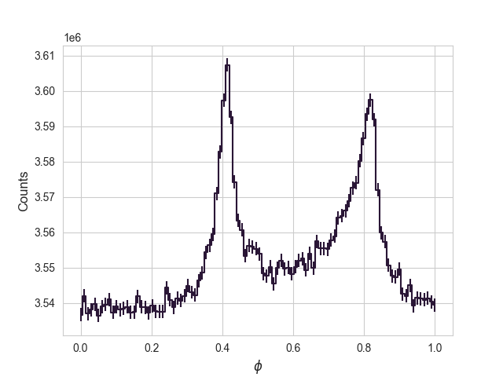

# gbm-pulsar
A GBM tool for X-ray pulsar analysis

Example:

```
python GBM_pulsar_pipeline.py --gbm_dir="/path/to/GRM/data" \
        --tstart='2022-07-27T00:00:00' --tstop='2022-07-28T00:00:00' \
        --output_dir="/path/to/save/data" \
        --stem="gbmCrab" --ra=83.883225 --dec=22.014458333333334 \
        --barycor --jplephem="./barycor/de421.bsp"
```

some optional:

```
python GBM_pulsar_pipeline.py --gbm_dir="/path/to/GRM/data" \
        --tstart='2022-07-27T00:00:00' --tstop='2022-07-28T00:00:00' \
        --output_dir="/path/to/save/data" \
        --stem="gbmCrab" --ra=83.883225 --dec=22.014458333333334 \
        --barycor --jplephem="./barycor/de421.bsp" \
        --energylow=8 --energyhigh=25 \
        --store_pha --store_det
```

Here's one day profile folded by Jodrell Bank emphemeris, barycorr and selection works fine:

